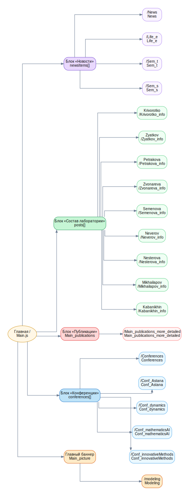
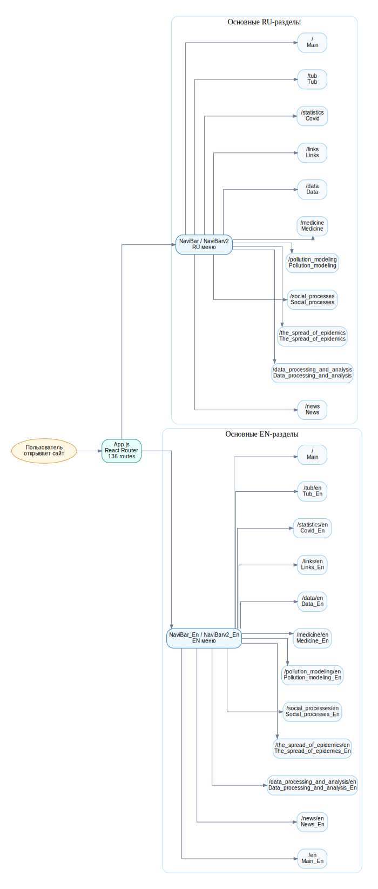
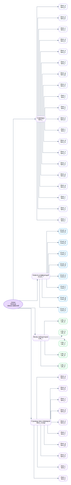
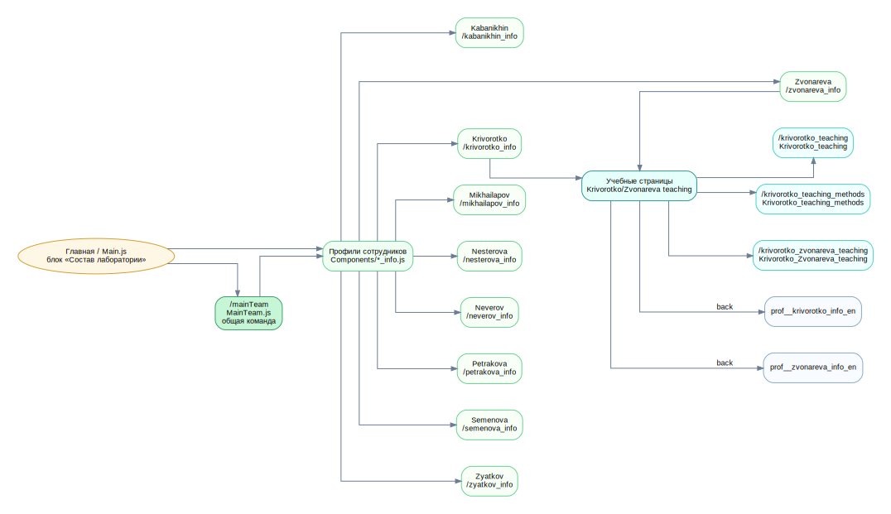
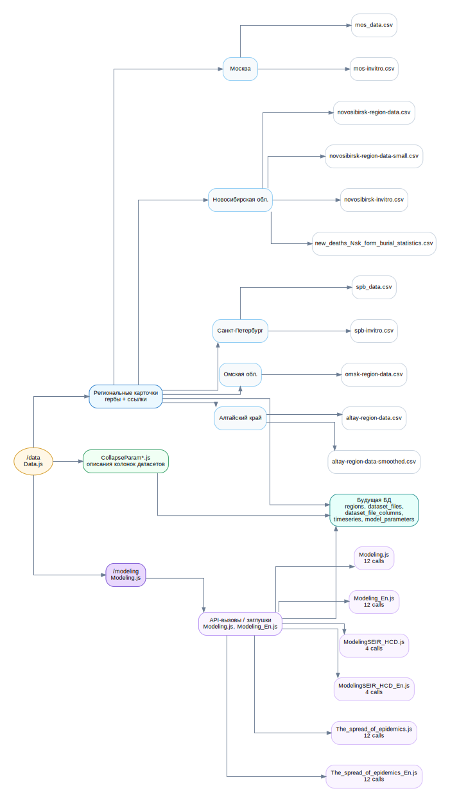
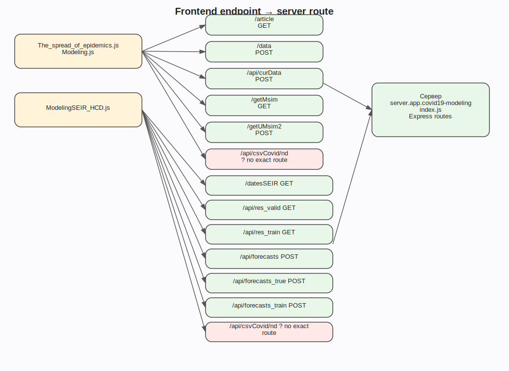
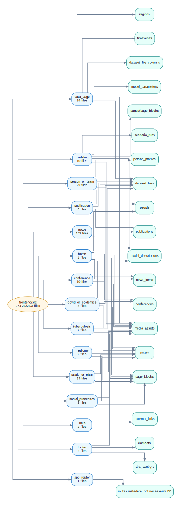

# Карта SVG-схем фронтенда

Ниже собраны ссылки на SVG-схемы. Файлы переименованы по порядку, чтобы их было удобно открывать и вставлять в документацию.

## 01. Главная страница

[Открыть SVG](./01_home_page_journey.svg)

## 02. Навигационная панель

[Открыть SVG](./02_navigation_bar.svg)

## 03. Новости

[Открыть SVG](./03_news_flow.svg)

## 04. Команда и сотрудники

[Открыть SVG](./04_people_and_team_flow.svg)

## 05. Данные и моделирование

[Открыть SVG](./05_data_and_modeling_flow.svg)

## 06. Карта endpoint-ов

[Открыть SVG](./06_endpoint_map.svg)

## 07. Типы страниц → таблицы БД

[Открыть SVG](./07_page_types_to_database.svg)

